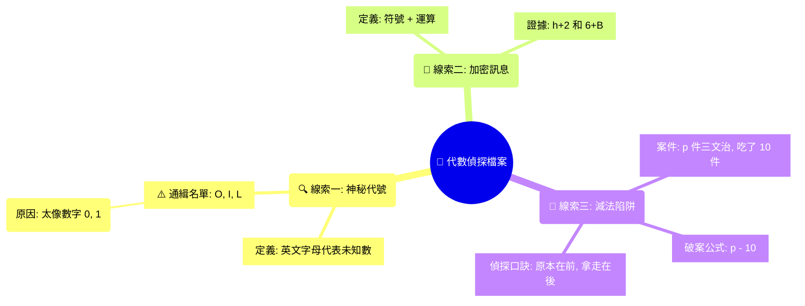

# mindmap

```mermaid
mindmap
  root((📁 代數偵探檔案))
    (🔍 線索一: 神秘代號)
      [定義: 英文字母代表未知數]
      [⚠️ 通緝名單: O, I, L]
        (原因: 太像數字 0, 1)
    (🧩 線索二: 加密訊息)
      [定義: 符號 + 運算]
      [證據: h+2 和 6+B]
    (🚨 線索三: 減法陷阱)
      [案件: p 件三文治, 吃了 10 件]
      [破案公式: p - 10]
      [偵探口訣: 原本在前, 拿走在後]
```
